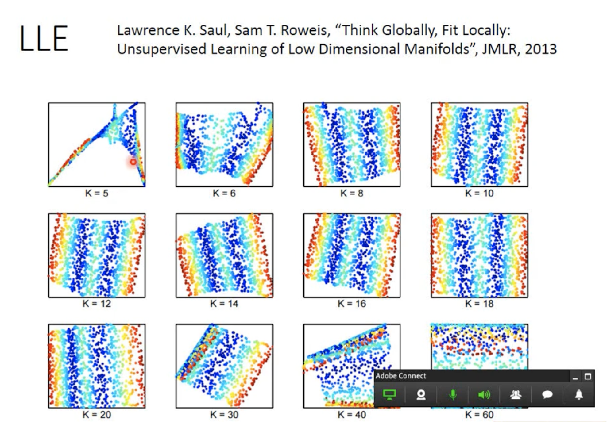
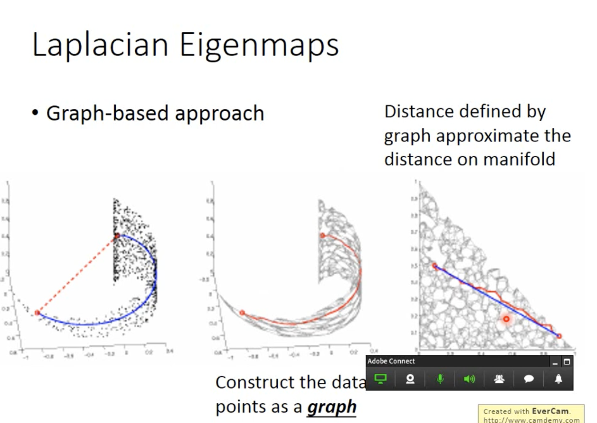
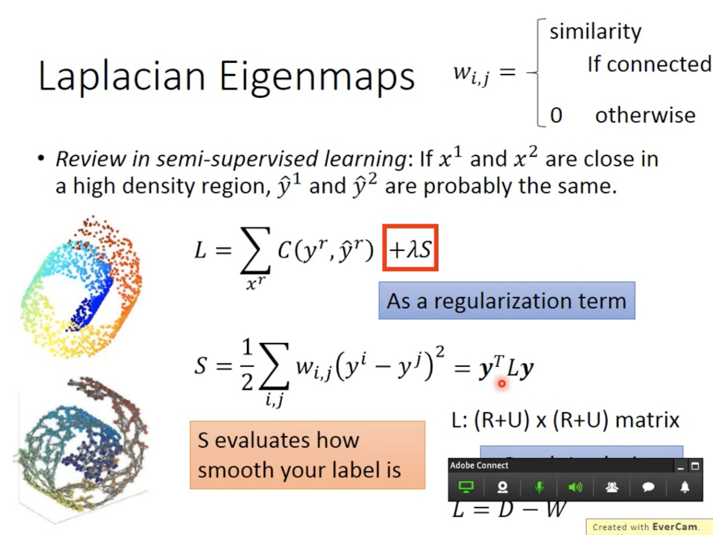
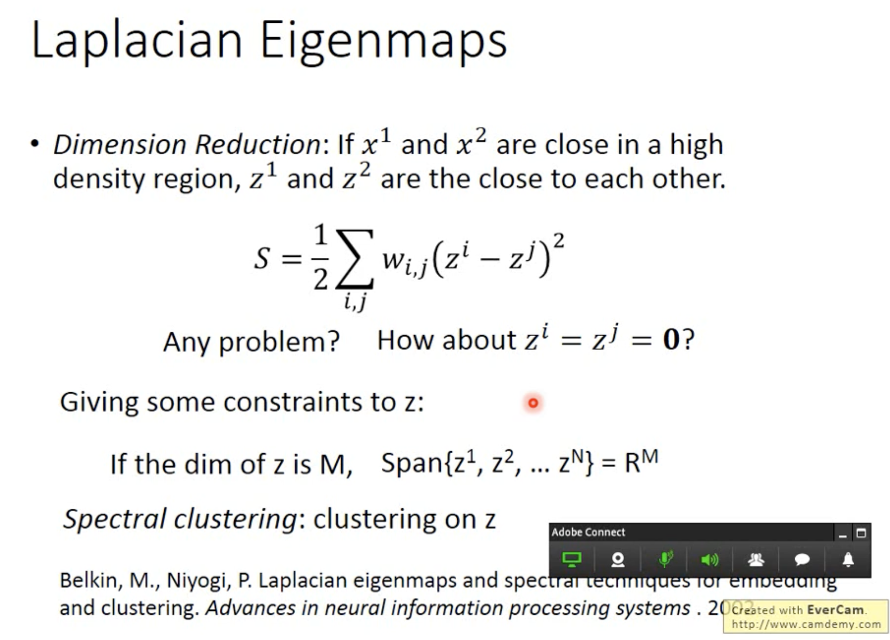
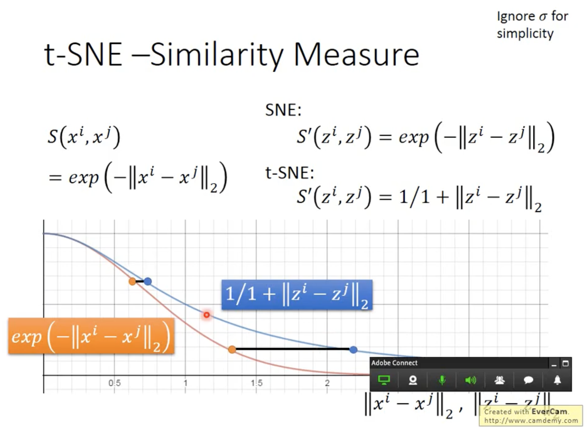
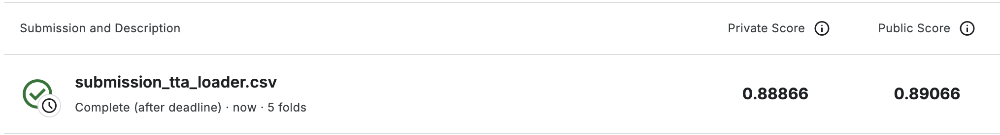
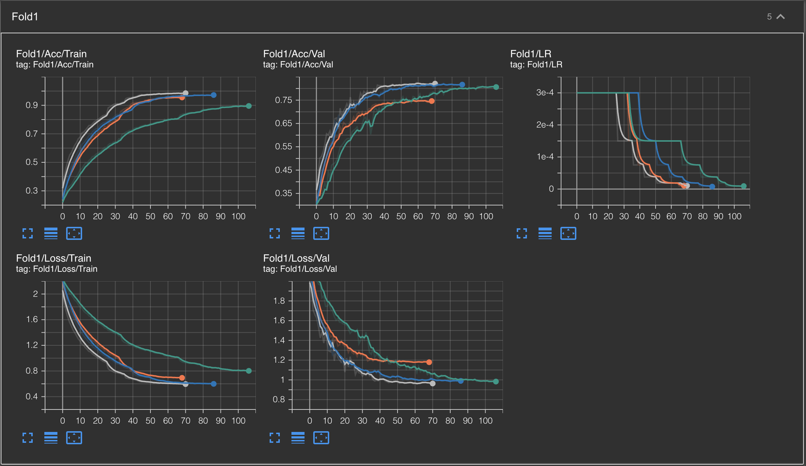

# HW3 CNN
> 2025.5.18 - 2025.5.21

## TODO

- [x] Augmentation Implementation
- [x] Visual Representations Implementation
- [x] CNN
- [x] Training Augmentation
- [x] add dropout layer
- [x] Test Time Augmentation
- [x] t-SNE Report
- [x] ensemble & Comparision

## Report

### Q1 Augmentation Implementation

```python
from torchvision import transforms

train_tfm = transforms.Compose([
    transforms.RandomResizedCrop(224, scale=(0.8, 1.0)),   # Random crop & resize
    transforms.RandomHorizontalFlip(p=0.5),                # Flip horizontally
    transforms.RandomRotation(15),                         # Random rotation ±15°
    transforms.ColorJitter(brightness=0.3, contrast=0.3, saturation=0.3),  # Color jitter
    transforms.RandomGrayscale(p=0.1),                     # 10% chance to grayscale
    transforms.ToTensor(),                                 # Convert to tensor
    transforms.Normalize(mean=[0.485, 0.456, 0.406],       # Normalize to ImageNet stats
                         std=[0.229, 0.224, 0.225])
])
```

其中，normalize 是为了将 RGB 通道标准化为 ImageNet 等的标准。

```python
mean = [0.485, 0.456, 0.406]  # For R, G, B
std  = [0.229, 0.224, 0.225]
```

### Q2 Visual Representations Implementation

#### Locally Linear Embedding (LLE)

$w_{i,j}$ 展示高维空间中 $x_i$ 与 $x_j$ 的关系，即最小化

$$
\sum_i||x^i-\sum_j w_{i,j}x^j||_2
$$

然后试着在低维空间中找到 $z_i$ 与 $z_j$，仍满足可以用 $w_{i,j}$ 来表示他们的关系，即最小化：

$$
\sum_i||z^i-\sum_j w_{i,j}z^j||_2
$$

选取相邻的 $k$ 个点，$k$ 不能太大，不然失去意义。



#### Laplacian Eigenmaps



与 semi-supervised learning 结合：



或者限制解空间为 $M$ 维。



#### T-distributed Stochastic Neighbor Embedding (t-SNE)

解决没有防止不相邻的点聚集在一起的问题。

在高低维空间中计算每个 pair 的相似度，并每个点对其他点做 normalization。

让高低维的 distribution 接近，用 KL 衡量。

Similarity Measure: 
$$
S(x^i,x^j) = exp(-||x^i-x^j||_2)
$$

t-SNE:

$$
S'(z^i,z^j) = 1/(1+||z^i-z^j||_2)
$$



原本在高维空间距离远的可以拉得更远，更好分离。

## Practice

做了 Q1 中的图像增强，并跑了 76 个 epoch，val_acc 0.758，public score 0.78000, private score 0.77133，通过 Medium Baseline。

加入 dropout=0.5，并跑了 104 个 epoch，val_acc 0.7792, public score 0.80333, private score 0.81000，通过 Strong Baseline。

加入 labelsmoothing，使用多个模型的第一折 ensemble，推理加入 tta（做 4 组独立的 train_tfm 变换），public score 0.86933, private score 0.86333。

对不同模型组合对比如下：

| Model Name               | Public Score | Private Score |
| ------------------------ | ------------ | ------------- |
| Classifier               | 0.81933      | 0.81200       |
| ResNet18                 | 0.83933      | 0.81600       |
| EfficientNetB0Classifier | 0.82866      | 0.83400       |
| MobileNet                | 0.76466      | 0.76533       |
| 4 Models 1 Fold          | 0.86933      | 0.86333       |
| 4 Models 2 Folds         | 0.88200      | 0.87600       |
| 3 Models 2 Fold          | 0.88333      | 0.88066       |

发现 `MobileNet` 明显表现较弱，故选取剩下其他三个 model 做 ensemble。

对不同 TTA k-ratio 做测试。
$$
final = std \times k + tta \times (1-k)
$$

| k-ratio | Public Score | Private Score |
| ------- | ------------ | ------------- |
| 0.8     | 0.88333      | 0.88066       |
| 0.7     | 0.88266      | 0.88266       |
| 0.6     | 0.88600      | 0.88533       |
| 0.5     | **0.88666**  | **0.88800**   |
| 0.4     | 0.88600      | 0.88800       |
| 0.3     | 0.88666      | 0.88666       |
| 0.2     | 0.88600      | 0.88400       |

此时已通过 Boss Baseline。

坚持把 5-fold 跑完，挑选 3 个 model 结果如下：





### 总结

Augmentation 是最基础的图像数据增强方式，同时添加 dropout 层可有效提高泛化能力。

cross-validation + ensemble （尤其是 ensemble）可以显著提高模型的泛化能力。

## Reference

1. Hung-yi Lee, ML Lecture 15: Unsupervised Learning - Neighbor Embedding https://www.youtube.com/watch?v=GBUEjkpoxXc
