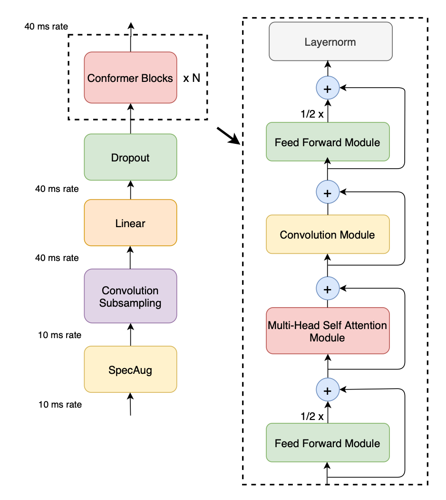
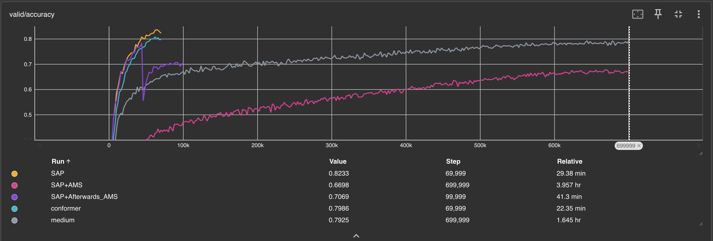

# HW4 Self-attention
> 2025.5.20 - 2025.5.24

## TODO

- [x] Self-attention
- [x] Conformer

### Self-attention


#### 0 Overall Construction

典型的 Self-Attention 模块由如下组件组成：

1. **输入序列**
2. **位置编码**（Positional Encoding）
3. **Query / Key / Value 映射**
4. **Scaled Dot-Product Attention**（注意力核心）
5. **Multi-Head Attention**
6. **输出线性变换**
7. **（可选）Truncated Self-Attention 以减小计算量**

#### 1️⃣ 输入表示 $X$

输入序列张量：% [T, D]

$$
X = [x_1, x_2, \dots, x_T] \in \mathbb{R}^{T \times d_{\text{model}}}
$$

* $T$：序列长度
* $d_{\text{model}}$：每个 token 的表示维度

#### 2️⃣ Positional Encoding 位置编码

由于 Self-Attention 是无序的，为建模位置信息需加入位置编码：

* **可学习（Learnable）**
* **正余弦函数（原始 Transformer 方案）**

$$
\text{PE}_{(pos, 2i)} = \sin\left(\frac{pos}{10000^{2i/d_{\text{model}}}}\right)
$$

$$
\text{PE}_{(pos, 2i+1)} = \cos\left(\frac{pos}{10000^{2i/d_{\text{model}}}}\right)
$$

> 这样使得不同位置拥有可区分的位置向量，同时具有良好的泛化性。

#### 3️⃣ Query / Key / Value 映射

将输入 $X$ 映射为查询、键、值三组矩阵：

$$
Q = XW^Q, \quad K = XW^K, \quad V = XW^V
$$

* $W^Q, W^K, W^V \in \mathbb{R}^{d_{\text{model}} \times d_k}$
* 一般 $d_k = d_v = d_{\text{model}} / h$，其中 $h$ 是头数

#### 4️⃣ Scaled Dot-Product Attention 核心机制
% [T, D]

$$
\text{Attention}(Q, K, V) = \text{softmax}\left( \frac{QK^T}{\sqrt{d_k}} \right)V
$$

解释：

* $QK^T$：计算相关性（相似度）
* $\sqrt{d_k}$：防止梯度爆炸
* $\text{softmax}$：归一化为注意力权重
* 加权求和 $\sum_i \alpha_i V_i$：聚焦高权重值的信息

#### 5️⃣ Multi-Head Attention

为了捕捉不同语义子空间的注意力结构，引入多头：% [T, D]

$$
\text{head}_i = \text{Attention}(QW_i^Q, KW_i^K, VW_i^V)
$$

$$
\text{MultiHead}(Q, K, V) = \text{Concat}(\text{head}_1, ..., \text{head}_h)W^O
$$

其中：

* $W_i^Q, W_i^K, W_i^V \in \mathbb{R}^{d_{\text{model}} \times d_k}$
* $W^O \in \mathbb{R}^{hd_k \times d_{\text{model}}}$

Multi-Head Attention 允许模型并行计算多个注意力路径，从不同角度捕捉上下文信息。

#### 6️⃣ 输出线性变换 + 残差 + LayerNorm

$$
\text{Output} = \text{LayerNorm}(X + \text{Dropout}(\text{MultiHead}(Q, K, V)))
$$

这一步保证模型训练稳定，并允许信息在多层中流动。

#### 7️⃣ Truncated Self-Attention（截断自注意力）

在处理超长序列（如语音、音频、长文本）时，计算量为 $O(T^2)$，难以扩展。

**解决办法：限制注意力感受野，仅注意邻域窗口**：

$$
\text{Mask}_{i,j} = 
\begin{cases}
1, & \text{if } |i - j| \le w \\
0, & \text{otherwise}
\end{cases}
$$

在 softmax 之前将非邻域位置强制设为 $\text{mask}_{i,j} =-\infty$ 以避免其参与注意力：

$$
\text{Attention}(Q, K, V) = \text{softmax}\left( \frac{QK^T}{\sqrt{d_k}} + \text{mask} \right)V
$$

### Conformer（Convolution-augmented Transformer for Speech Recognition）

Conformer 是 2020 年 Google Research 提出的架构，用于提升语音建模能力，在语音识别、说话人识别等任务中被广泛采用。[2]

**Transformer** 擅长建模长距离依赖，但缺乏局部建模能力；

**CNN** 擅长局部建模，但缺乏全局上下文感知能力；

**Conformer** 结合两者优点，提出如下核心结构：

> **Conformer = Feed-Forward Module + Multi-Head Self-Attention + Convolution Module + Feed-Forward Module + Layer Norm**

并配合残差连接、前后归一化、Gated机制等，构建出更稳定、鲁棒、强表达能力的语音编码器。

#### 整体架构结构图（单个 Block 为例）

```
Input
  │
  ├──➤ FeedForward Module（1/2残差）
  │
  ├──➤ Multi-Head Self-Attention + LayerNorm
  │
  ├──➤ Convolution Module
  │
  ├──➤ FeedForward Module（1/2残差）
  │
  └──➤ Final LayerNorm
Output
```

每一层都使用了残差连接，并且 FeedForward Module 的残差连接乘了 0.5 系数（论文中称为 **Macaron-style FFN**）。

#### 1️⃣ Feed Forward Module（前馈模块）

结构类似于 Transformer 中的 FFN：

$$
\text{FFN}(x) = W_2 \cdot \text{Activation}(W_1 \cdot x + b_1) + b_2
$$

Conformer 中将其放在**开头和结尾**，每次残差连接仅加权 0.5：

$$
x' = x + \frac{1}{2} \cdot \text{Dropout}(\text{FFN}(x))
$$

激活函数通常使用 **Swish 或 GELU**。

#### 2️⃣ Multi-Head Self-Attention Module（MHSA）

标准 Transformer 结构，建模全局依赖：

$$
\text{Attention}(Q, K, V) = \text{softmax}\left(\frac{QK^T}{\sqrt{d_k}}\right) V
$$

其中：

* $Q = xW^Q$，$K = xW^K$，$V = xW^V$
* 通常也包括残差连接 + LayerNorm。

在 Conformer 中，该模块可结合**相对位置编码**，增强时序建模能力。

#### 3️⃣ Convolution Module（卷积模块）

这是 Conformer 的创新点！
用于增强模型的 **局部建模能力**，对局部时间窗口建模音素级别特征。

核心结构如下：

1. **LayerNorm**：
   对时间序列的每个向量做归一化：

   $$
   \text{LayerNorm}(x_t) = \frac{x_t - \mu}{\sqrt{\sigma^2 + \epsilon}}
   $$

2. **Pointwise Conv1d**（1×1卷积） + GLU：

   $$
   x \rightarrow \text{Conv1d}(x) \in \mathbb{R}^{2d}
   $$
   % 注意此时输出 d+d，下一步分为 a,b 两个信号。

   接着：

   $$
   \text{GLU}(a, b) = a \otimes \sigma(b)
   $$

   控制信息门（gating），引入非线性。

3. **Depthwise Separable Conv1d**（轻量卷积）：
   仅对每个通道做独立卷积，捕捉局部时间结构。

   $$
   \text{DWConv}(x) = x * k, \quad \text{with groups}=d
   $$

4. **BatchNorm + SiLU + Pointwise Conv + Dropout**

这层最终输出维度仍为 $d_{\text{model}}$，并加入残差。

#### 4️⃣ Macaron-Style Feed Forward（双 FFN）

论文指出，使用前后各一个 FFN 比仅中间一个更有效，并加上 $\frac{1}{2}$ 残差系数来平衡表达和稳定性。

#### 5️⃣ Final Layer Norm

最后统一对每个 block 输出进行 LayerNorm。

#### 完整 Conformer



#### 1. SpecAug

数据增强：SpecAugment: 

A Simple Data Augmentation Method for Automatic Speech Recognition
https://arxiv.org/abs/1904.08779

1. 在时间维度上对频谱做非线性变化来模拟声音的变化。
2. 在频率维度上随机选择（根据均匀分布）一些连续的频带，并将其值设为零，以模拟声音的噪声或失真
3. 在时间维度上随机选择（根据均匀分布）一些连续的时序，并将其值设为零，以模拟声音的噪声或失真

SpecAugment on Large Scale Datasets
https://arxiv.org/abs/1912.05533

基于上面的方法进行了研究，证明了其在大规模数据集任务上的有效性。

#### 2. Convolution Subsampling

Pooling vs. stride for downsampling [3]

卷积层可以学习比池化更多的信息，但同时计算开销大。

在 ResNet 的第一层就使用了卷积层，可以大幅度减小后续层的计算量。

然而卷积层让非常深的网络中梯度传播更加困难。

From the FishNet paper (Section 3.2):
> The layers in the head are composed of concatenation, convolution with identity mapping, and max-pooling. Therefore, the gradient propagation problem from the previous backbone network in the tail are solved with the FishNet by 1) excluding I-conv at the head; and 2) using concatenation at the body and the head.

将 conv2d 的 stride 设置为 2 进行下采样操作。

#### 3. Linear & Dropout

Linear 先对 downsampling 后的数据做映射，而此时加入 Dropout 可以随机丢弃一些特征，防止过拟合。

#### 4. Conformer Block

具体见上文。

### Self-Attention Pooling （注意力池化）

普通做法是平均池化或者是最大池化，但在此过程中忽略了不同时间点的“信息重要性差异“，而 Self-Attention Pooling 则使用了注意力机制来动态学习 “哪些时间帧更重要”，从而做到加权平均。[4]

序列输入：

$$
X=[x_1,x_2,\dots,x_T] \in \R^{T\times d}
$$

学习权重：所有位置对**一个中心向量**贡献 attention（权重和）

$$
\alpha = \text{softmax}(XV^TW^T) \in \R^T
$$

- $V\in \R^{d_a \times d}$：隐层映射
- $W\in \R^{1\times d_a}$：输出映射为标量
- $\alpha\in \R^T$：注意力向量

$$
h=\sum_{t=1}^T \alpha_tx_t \in \R^d
$$

### Additive Margin Softmax (AM-Softmax)

在分类任务中，通常使用 CrossEntropy 损失，但这样不能保证区分性和聚类性。AM-Softmax 就是一种度量学习增强型的 softmax，让 intra-class 更紧，inter-class 更远，提高辨识性。[5]

对输入特征 $x$ 和权重 $W$ 进行 L2 归一化：

$$
||x|| = ||W_i|| = 1 \Rightarrow \cos (\theta_i)=W_i^Tx
$$

对正确类别引入 **角度惩罚 margin $m$**：

$$
\mathcal{L}_{AM} = -\log \frac{e^{s(\cos\theta_y - m)}}{e^{s(\cos\theta_y - m)} + \sum_{j \neq y} e^{s\cos\theta_j}}
$$

* $s$：放大因子（scale），控制梯度强度；
* $m$：margin，迫使模型“更靠近自己的类中心”。

结合使用：

```
Input Mel Features
        ↓
  Feature Encoder (Conformer)
        ↓
  Self-Attention Pooling
        ↓
  Embedding (Linear)
        ↓
  AM-Softmax Loss (classification head)
```

### TODO: Survey of Transformers

Long Range Arena: A Benchmark for Efficient Transformers
https://arxiv.org/abs/2011.04006

Efficient Transformers: A Survey
https://arxiv.org/abs/2009.06732

## Practice

在 pred_layer 中加入 layernorm 和 dropout，并用 ReLU 替换 sigmoid，虽然此时 valid acc 仅有 0.70，但获得 Public Score 0.87075, Private Score 0.87350，通过 Medium Baseline。

画了个图，发现是欠拟合的，干脆把 steps 调到 700k，此时 valid acc 0.7143，Public Score 0.92750, Private Score 0.92775，通过 Strong Baselin，已经非常接近 Boss 了。

感觉调调参肯定能过 Boss，但还是改用了 Conformer，效果是显著的，在 70k steps 后，Public Score 0.93900，Private Score 0.93725，通过 Boss Baseline。

加入 Self Attention Pooling，Public Score 0.94775, Private Score 0.95050，进一步提升.

但如果直接加入 AM Softmax，其实收敛速度会变慢，甚至不如初始模型。

因此在正常 pred_layer 训练 30k steps 之后，再改用 AM Softmax，效果依旧不是太好。



## Reference

1. Hung-yi Lee,【機器學習2021】自注意力機制 (Self-attention) (上)  https://www.youtube.com/watch?v=hYdO9CscNes
2. Gulati et al., “Conformer: Convolution-augmented Transformer for Speech Recognition”, *INTERSPEECH 2020* https://arxiv.org/abs/2005.08100
3. itdxer (https://stats.stackexchange.com/users/64943/itdxer), Pooling vs. stride for downsampling, URL (version: 2019-07-22): https://stats.stackexchange.com/q/387522
4. Lee J, Lee I, Kang J. Self-attention graph pooling[C]//International conference on machine learning. pmlr, 2019: 3734-3743. https://arxiv.org/abs/1904.08082
5. Wang F, Cheng J, Liu W, et al. Additive margin softmax for face verification[J]. IEEE Signal Processing Letters, 2018, 25(7): 926-930. https://arxiv.org/abs/1801.05599