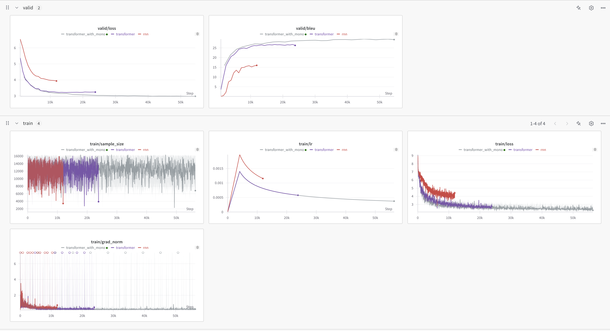
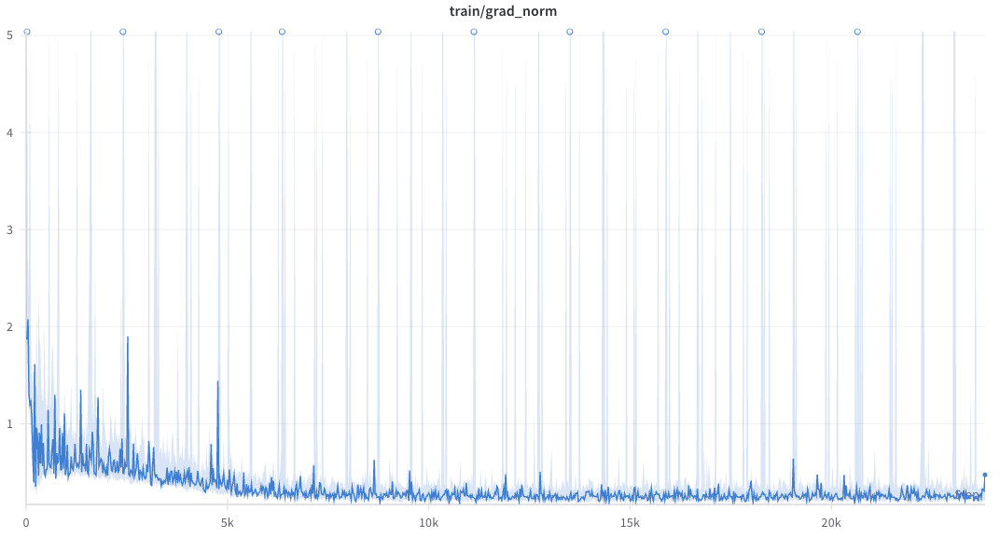

# HW5 Transformer

> 2025.6.29 - 2025.7.1

## TODO

- [x] Transformer
- [x] Cross-Attention

### 1 Transformer

```plain
┌─────────────────────────┐        ┌─────────────────────────┐
│        Encoder          │        │        Decoder          │
│                         │        │                         │
│  Input Embedding + PE   │        │  Target Embedding + PE  │
│      ↓                  │        │      ↓                  │
│  N × (Self-Attention +  │        │  N × (Masked Self-Attn  │
│       Add&Norm +        │        │       + Add&Norm +      │
│       FeedForward +     │        │       Cross-Attn +      │
│       Add&Norm)         │        │       Add&Norm +        │
│                         │        │       FeedForward +     │
│      …×N layers         │        │       Add&Norm)         │
└─────────────────────────┘        └─────────────────────────┘
            ↓                                  ↓
    Encoder Outputs                   Final Linear + Softmax
```


### 2 注意力（Attention）机制基础

#### 2.1 Queries, Keys, Values
对每一个位置 i，有三个向量：
$\mathbf{q}_i \in \mathbb{R}^{d_k},\quad
\mathbf{k}_i \in \mathbb{R}^{d_k},\quad
\mathbf{v}_i \in \mathbb{R}^{d_v}$

这些向量来自同一输入（Self-Attention）或不同输入（Cross-Attention）。

#### 2.2 Scaled Dot-Product Attention（回顾）

给定所有 Queries 矩阵 $\mathbf{Q}\in\mathbb R^{L_q\times d_k}$，
Keys 矩阵 $\mathbf{K}\in\mathbb R^{L_k\times d_k}$，
Values 矩阵 $\mathbf{V}\in\mathbb R^{L_k\times d_v}$，

计算公式为：
$$
\mathrm{Attention}(\mathbf{Q},\mathbf{K},\mathbf{V})
\;=\;
\mathrm{softmax}\Bigl(\frac{\mathbf{Q}\,\mathbf{K}^\top}{\sqrt{d_k}}\Bigr)\;\mathbf{V}
$$
- $\mathbf{QK}^\top\in\mathbb R^{L_q\times L_k}$：衡量每对 Query–Key 的相似度
- 除以 $\sqrt{d_k}$：防止维度过大导致 softmax 梯度消失
- 最后乘 $\mathbf{V}$：按权重线性组合 Value

### 3 Multi-Head Attention（多头注意力）

为提升模型表达能力，引入 h 个“头”并行计算，然后拼接再线性映射：

1.	线性映射

对输入 $\mathbf{X}\in\mathbb R^{L\times d_{\text{model}}}$，
每个头都有自己的投影：
$$
\mathbf{Q}i = \mathbf{X}\mathbf{W}^Q_i,\quad
\mathbf{K}i = \mathbf{X}\mathbf{W}^K_i,\quad
\mathbf{V}i = \mathbf{X}\mathbf{W}^V_i,
\quad i=1,\dots,h
$$
其中 $\mathbf{W}^Q_i,\mathbf{W}^K_i\in\mathbb R^{d{\text{model}}\times d_k}$，
$\mathbf{W}^V_i\in\mathbb R^{d{\text{model}}\times d_v}$，通常 $d_k=d_v=d{\text{model}}/h$。

2.	并行注意力

对每个头：
$$\mathbf{H}_i \;=\;
\mathrm{Attention}(\mathbf{Q}_i,\mathbf{K}_i,\mathbf{V}_i)
\quad\in\mathbb R^{L\times d_v}$$

3.	拼接 & 输出映射
$$\mathrm{MultiHead}(\mathbf{X})
= \bigl[\mathbf{H}_1,\dots,\mathbf{H}h\bigr]\mathbf{W}^O,
\quad \mathbf{W}^O\in\mathbb R^{(h\,d_v)\times d{\text{model}}}$$

### 4 Transformer Encoder Layer 

对输入 $\mathbf{X}^{(\ell)}$（第 $\ell$ 层输入）：

1.	多头自注意力 + 残差 + LayerNorm
$$\mathbf{Z}^{(\ell)} =
\mathrm{LayerNorm}\bigl(\mathbf{X}^{(\ell)} +
\mathrm{MultiHead}(\mathbf{X}^{(\ell)})\bigr)$$

2.	前馈网络 + 残差 + LayerNorm
$$\mathbf{X}^{(\ell+1)} =
\mathrm{LayerNorm}\bigl(\mathbf{Z}^{(\ell)} +
\mathrm{FFN}(\mathbf{Z}^{(\ell)})\bigr)$$
其中
$\mathrm{FFN}(\mathbf{u})
= \mathrm{ReLU}(\mathbf{u}\mathbf{W}_1 + \mathbf{b}_1)\,\mathbf{W}_2 + \mathbf{b}_2$

### 5 Transformer Decoder 中的 Cross-Attention

Decoder 每层包含三部分：Masked Self-Attention、Cross-Attention、Feed-Forward。

#### 5.1 Masked Self-Attention（公式同 Encoder，只是在 $\mathbf{QK}^\top$ 前加遮罩）

#### 5.2 Cross-Attention
- Query 来自上一子层的输出 $\mathbf{S}^{(\ell)}\in\mathbb R^{L_t\times d_{\text{model}}}$。
- Key, Value 来自 Encoder 的最终输出 $\mathbf{E}\in\mathbb R^{L_s\times d_{\text{model}}}$。

具体几步：
1.	线性投影
$$
\mathbf{Q}_c = \mathbf{S}^{(\ell)}\,\mathbf{W}^Q_c,\quad
\mathbf{K}_c = \mathbf{E}\,\mathbf{W}^K_c,\quad
\mathbf{V}_c = \mathbf{E}\,\mathbf{W}^V_c
$$
2.	Scaled Dot-Product
$$
\mathbf{A}_c = \mathrm{softmax}\Bigl(\frac{\mathbf{Q}_c\,\mathbf{K}_c^\top}{\sqrt{d_k}}\Bigr)
\quad\in\mathbb R^{L_t\times L_s}
$$
3.	输出
$$
\mathrm{CrossAttn}(\mathbf{S}^{(\ell)},\mathbf{E})
= \mathbf{A}_c\,\mathbf{V}_c
\quad\in\mathbb R^{L_t\times d_v}
$$
4.	残差+LayerNorm
$$
\mathbf{U}^{(\ell)} =
\mathrm{LayerNorm}\bigl(\mathbf{S}^{(\ell)} +
\mathrm{MultiHeadCross}(\mathbf{S}^{(\ell)},\mathbf{E})\bigr)
$$

这里的 MultiHeadCross 与一般 Multi-Head Attention 结构一致，只是输入来源分开。


### 6 Transformer Decoder Layer

设上层输出 $\mathbf{X}_d^{(\ell)}$，Encoder 输出 $\mathbf{E}$，
1.	Masked Self-Attn
$$
\mathbf{Y}^{(\ell)} =
\mathrm{LayerNorm}\bigl(\mathbf{X}_d^{(\ell)} +
\mathrm{MultiHead}(\mathbf{X}_d^{(\ell)})\bigr)$$
2.	Cross-Attn
$$\mathbf{Z}^{(\ell)} =
\mathrm{LayerNorm}\bigl(\mathbf{Y}^{(\ell)} +
\mathrm{MultiHeadCross}(\mathbf{Y}^{(\ell)},\mathbf{E})\bigr)$$
3.	Feed-Forward
$$\mathbf{X}_d^{(\ell+1)} =
\mathrm{LayerNorm}\bigl(\mathbf{Z}^{(\ell)} +
\mathrm{FFN}(\mathbf{Z}^{(\ell)})\bigr)$$

## 目标

将英文句子翻译成繁体中文，由于中英文之间句子长度不同，采用 Seq2Seq（序列到序列）模型框架来处理。

## 数据集说明

共由两部分组成。

1. 双语数据（Parallel Data）：TED2020，使用的是 英文(en) 与繁体中文(zh-tw) 对齐的翻译对。
2. 单语数据（Monolingual Data）：仅包含繁体中文 TED 演讲字幕，用于 **反向翻译（Back Translation）** 提升模型泛化能力。

## 评估标准：BLEU分数

- Modified n-gram precision：统计翻译输出和参考答案之间的 n-gram 匹配（n = 1~4）
- Brevity Penalty：惩罚生成过短的句子

$$
\text{BLEU} = \text{BP} \cdot \exp\left(\sum_{n=1}^4 w_n \log p_n \right)
$$

## Preprocess

- 清洗、规范化
- 删除异常句（过长/过短）
- Tokenization：子词级分词（Subword）

subword tokenize 可以减小词表大小，并缓解 OOV（词汇未登录）的问题

## Practice

根据 hint 调 learning rate，epoch 翻倍，val 18.30

改用 Transformer，val 26.76

利用单语数据合成伪双语数据，进一步提升翻译模型效果。

先训一个 zh->en 的反向翻译模型，将大量中文单语数据翻译成英文（145min），组合成新的伪平行对（en, zh），用于训练更强的正向翻译模型（en → zh）。

单语数据需与平行数据同属一个语域（TED数据）且反向模型性能越强，伪数据质量越高。

最终训到30个epoch，大概花了9个小时，取最后5个做平均，得到 val 29.94。



## Gradescope

### Problem 1

```python
import torch
import torch.nn.functional as F
import matplotlib.pyplot as plt
import seaborn as sns

pos_emb = model.decoder.embed_positions.weight.cpu().detach()  # (N, D)
N = pos_emb.size(0)

similarity_matrix = torch.zeros((N, N))
for i in range(N):
    for j in range(N):
        similarity_matrix[i, j] = F.cosine_similarity(pos_emb[i].unsqueeze(0), pos_emb[j].unsqueeze(0))

plt.figure(figsize=(8, 6))
sns.heatmap(similarity_matrix.numpy(), cmap='viridis')
plt.title("Decoder Positional Embedding Similarity")
plt.xlabel("Position")
plt.ylabel("Position")
plt.show()
```

### Problem 2



大于1的部分即为。

## Reference

[1] Hung-yi Lee, 【機器學習2021】Transformer (上) https://www.youtube.com/watch?v=n9TlOhRjYoc

[2] Wikipedia, Transformer (deep learning architecture) https://en.wikipedia.org/wiki/Transformer_(deep_learning_architecture)