# HW6 Generative Model

> 2025.7.1 - 2025.7.4

Generative Model 引入 Distribution：让机器拥有创造的能力。

## TODO

[x] GAN
[x] StyleGAN

### 1 StyleGAN

Paper: [arxiv 1812.04948](https://arxiv.org/abs/1812.04948) [1]

传统 GAN 将 latent code z 仅在第一层输入，这会导致高层属性(global feature)与随机细节(noise)难以分离，且不易按照空间尺度精细控制，难以实现“低分辨率层控制大结构，高分辨率层控制细节”的编辑。

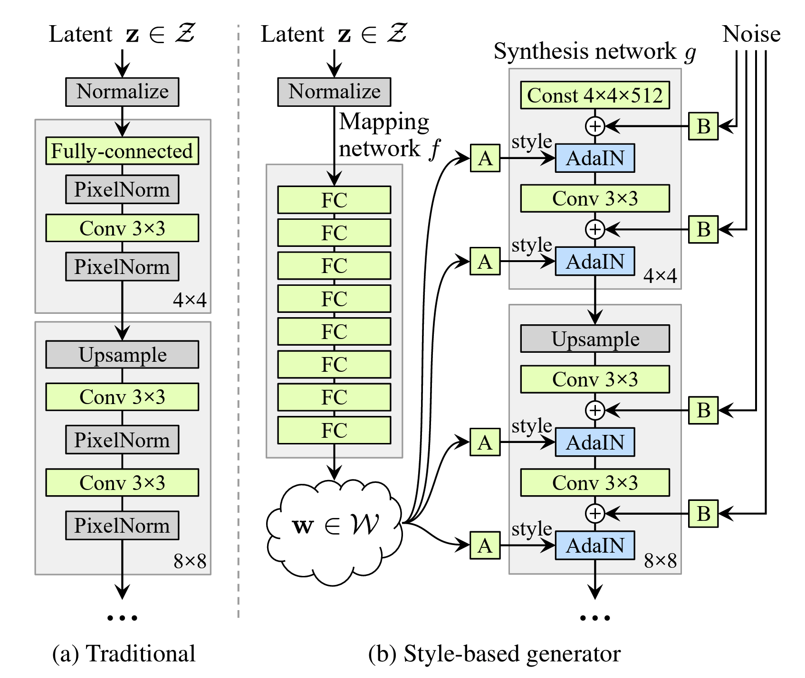

StyleGAN 主要由两个网络构成，mapping network $f$ 包含 8 个全连接层，将输入 latent code $z\sim P(z)$ 映射到一个latent space $w=f(z) \sim \mathcal W$，更容易解藕因子。

另一个 network 是 synthesis network $g$，包含 18 个 layers，分辨率从 4x4 进阶到 1024x1024，最后一层通过 1x1 卷积转换成 RGB。每一个 block 中包含 AdaIN（自适应实例归一化，对每层图的每个通道做归一），并按照风格向量 $y=(y_s,y_b)$ 做缩放和平移 A，当然还有噪声注入 B 用于生成随机细节。

#### 1.1 mapping network 与特征解藕

$\mathcal Z$ 和 $\mathcal W$ 均为 512x1 的空间，在 StyleGAN 中，$\mathcal W$ 空间里的 latent code 不作为生成图像的 feature map，而是用于控制主干生成网络 A，从而间接控制输出图像的特征。

这样做的目的就是更好的控制 feature。传统方法直接从 $\mathcal Z$ 空间中采样的数据会需要和训练数据中 match，即分布情况类似。此时 $\mathcal Z$ 空间为保证采样 match 源数据集 latent code，会扭曲（curve）自己的分布，导致一些特征不再线性，解耦性能因此下降。

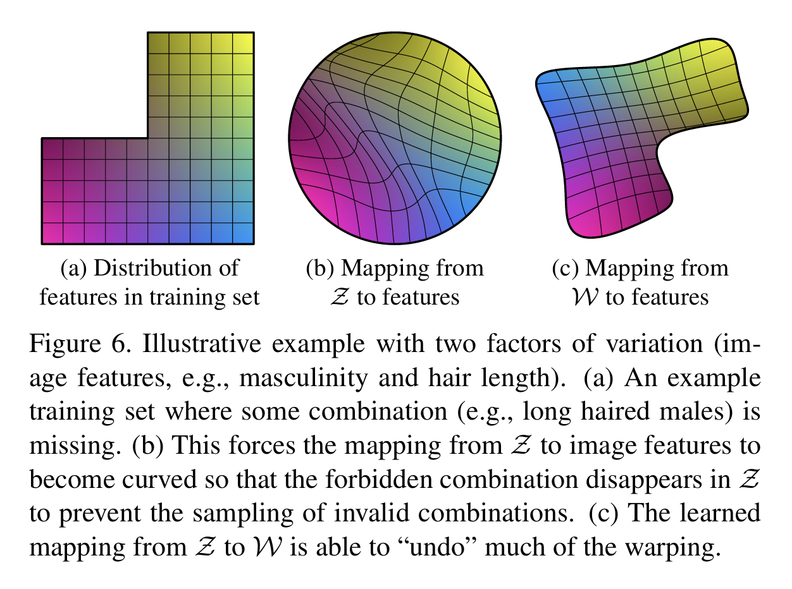

例如，上图中的黄色到蓝色区域和粉色到蓝色区域原本各自是一个线性的特征，但在Z空间里被扭曲了，如果在里面对latent code做插值，对应图像的特征显然不能线性变化，同时还会引发其他特征难预料的变化，这种情况下，disentanglement 就不成功了。

长头发和男子气概往往不会同时出现，如图(a)中，左上角则表示男子气概和长头发同时存在的分布空缺；mapping network 则学到一种非线性变换，将原本均匀的特征空间扭曲变形，使其接近真实情况。

mapping network 就是为了解决这个问题，它能够避免这种扭曲，保留数据集中不同特征组合的分布情况。

此外，论文还提出了两个分析模型解耦性能的指标：PPL 和 Linear Separability。

**Perceptual Path Length, PPL 感知路径长度**

如下图，已知白色的狗所表示的 latent code 是 $z_1$，目标图像是黑色的狗，黑狗图像的 latent code 是 $z_2$，图中蓝色的虚线是 $z_1$ 到 $z_2$ 最快的路径，在蓝色的路径中的中间图像应该是 $z_1$ 和 $z_2$ 的组合，假设这种组合是线性的（当特征充分解耦的时候），蓝色路径上生成的中间图像也是狗（符合 latent-space interpolation），但是绿色的曲线由于偏离路径太多，生成的中间图像可能是其他的，比如图上的卧室，这是我们不希望的结果。

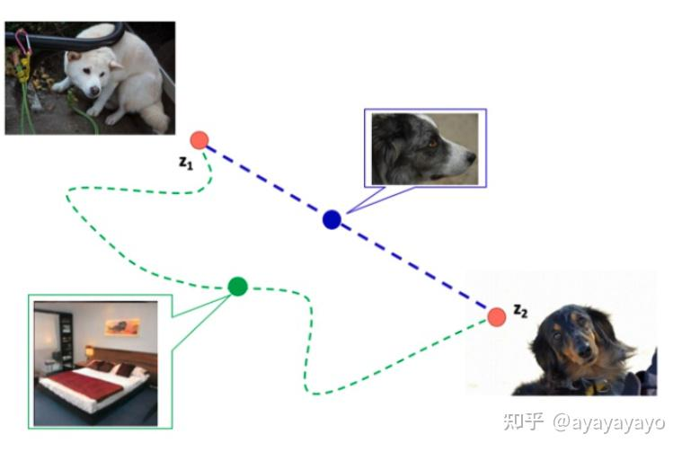

PPL 就是用于判断 Generator 是否选择了最近路线（如上图蓝色虚线）的指标，用训练过程中相邻时间节点上的两个生成图像的距离来表示。

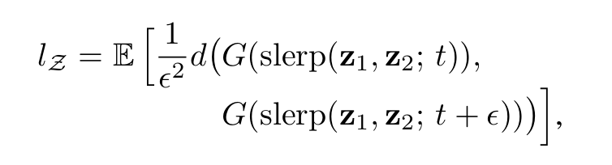

其中 $G$ 表示 Generator, $d(\cdot,\cdot)$ 表示 perceptual distance，slerp 表示 spherical interpolation 即在 latent space 上相邻两个时间点进行插值。

而在 $\mathcal W$ 空间，将 spherical interpolation 转换成线性插值 linear interpolation, lerp。

**Linear Separability，线性可分性**

如果一个 latent space 是充分解藕的，那么应当存在某些方向向量，使其对应的超平面可以将不同的二元属性（如“男性/女性”、“戴眼镜/不戴眼镜”）线性地分开。该度量即用来量化这种“线性分离能力”。

具体的，对一些 binary 的属性，希望能够通过不同的 latent code 实现线性可分，即两种划分是平行的：

1. 图像二元分类
2. SVM 线性分类器分类对应 latent code

因此其线性可分性指标可以通过二者条件熵计算，对多个不同 binary 属性的条件熵在对数域下累加，映射回线性域后即可得到容易对比的线性尺度。

$$
H(Y|X) = -\sum_{x\in \{0,1\}} \sum_{y\in\{0,1\}} P(x,y)\log P(y,x) \\
\text{Separability Score} = \exp(\sum_{i=1}^m H(Y_i,X_i))
$$

其中 $X$ 为 SVM 的预测类别（超平面的一侧），$Y$ 为辅助分类器的真值标签。

#### 1.2 AdalIN (Adaptive Instance Normalization, 自适应实例归一化)

Generator 从 4x4，变换到 8x8，并最终变换到 1024x1024，而每个 block 都会受两个控制向量（A）对其施加影响，其中一个控制向量在 Upsample 之后对其影响一次，另外一个控制向量在 Convolution 之后对其影响一次，影响的方式均为 AdaIN。

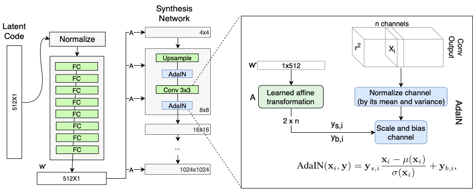

如上图，$\mathcal W'$ 先通过一个仿射变换 A （即一个 FC）扩变为缩放因子 $y_{s,i}$ 与 偏差因子 $y_{b,i}$，这两个因子参与标准化后的卷积输出做加权和，即可影响图片的 global feature（标准化抹去局部信息的可见性），而保留生成人脸的关键信息则由上采样层和卷积层来决定。

#### 1.3 Stochastic variation 随机噪声

StyleGAN 在每一个尺度的 feature map 计算时，都会引入一个额外的 Gaussian 噪声分量 $B$，这是为了让模型能够合成出随机性高的局部特征（人像中有许多细粒度随机变化的特征，例如头发细节，面部斑点，皱纹等，这些细节显得人像更为逼真和多样）

#### 1.4 Style Mixing

在训练时，从 $\mathcal W$ 空间里 sample 出两个不同的 latent code $w_1$, $w_2$ ，在生成图像过程中，将它们随机加入到不同 feature map 的 AdaIN 层里。这种方式使得相邻尺度的 style 相关性下降，更有利于优化 $\mathcal W$ 空间的解藕性能。

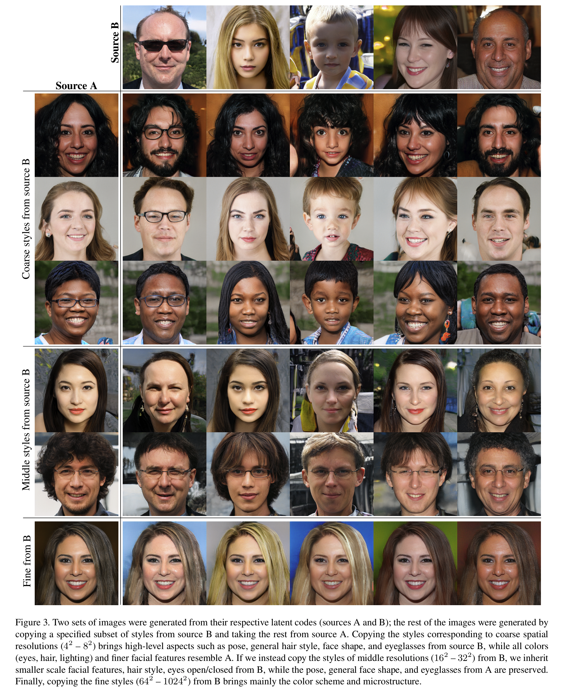

论文中的 fig 3 表现了 Style Mixing 的发现：对于 latent code $w$ 而言，如果它在低分辨率的 feature map 被加入，那么它对应的高级语义特征（例如脸的方向、头发的整体风格等）能够最终呈现出来，如果在高分辨率的 feature map 加入，那么它的细节特征（头发颜色等）会最终表现出来。

选取不同层插入从不同风格引入的风格向量，这种特性使得生成的照片在不同粒度具有不同风格。

### 2 StyleGAN2

Paper: [arxiv 1912.04958](https://arxiv.org/abs/1912.04958) [6]

#### 2.1 StyleGAN 的问题

StyleGAN2 的提出主要是为了消除 StyleGAN 的 IN 过程中产生的水滴效果（droplet artifacts），虽然在最终生成的图像中并不特别普遍明显，但在 generator network 中可以发现这个问题一直存在。

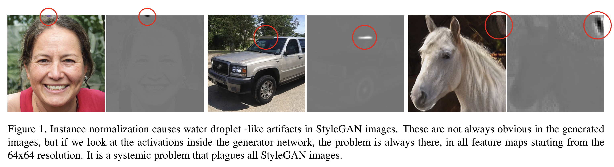

#### 2.2 StyleGAN2 架构改进

由于在 StyleGAN 中的 IN 是 per-channel 的，因此层与层之间的强度关系没有得到足够的考虑，normalization 用一个尖峰值替代了整个 feature map 的强度。去掉 normalize 后，水滴消失了。

因此，作者移除了 AdalIN，不再使用 $\mathcal W$ 空间的 mean 控制，只保留 std variance，归一化也只有 std variance。此外，噪声添加的位置也被移到 styleBlock 外，具体参考 (c)。

同时，作者注意到，std control 其实就是将 feature map (per channel) 进行了一个放缩而已。这个操作可以被放到卷积层里，具体表现就是给卷积核乘以这些放缩参数（在 paper 中被称为 weight demodulation）。

随后，作者进行了权重归一化的操作，最终得到了新的卷积参数。修改后的模型消除了 artifact，同时 StyleGAN 控制特征的能力在 StyleGAN2 中也得到了保留。

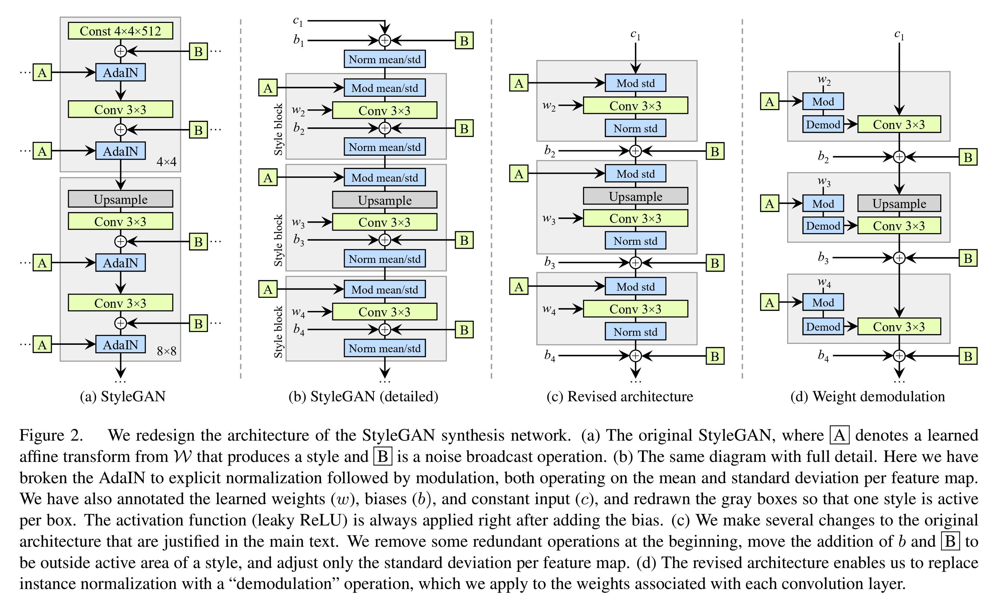

#### 2.3 其他改进

**1. Path Length Regularization, PLR 新的评价解藕性指标**

取 $w\in \mathcal W$，作者希望在 $w$ 任何一个方向变化一个固定的值后，图像属性发生的变化也是固定的，即图像对 $w$ 的梯度。

$$
\mathbb{E}_{\mathbf w,\mathbf y\sim \mathcal{N}(0,\mathbf I)}\Bigl(\|\mathbf J_{\mathbf w}^T \mathbf y\|_2 - a\Bigr)^2.
$$
其中 $g$ 是生成器， $\mathbf J_{\mathbf w}$ 代表图像 $y$ 对latent code $w$ 的梯度，$y$ 是像素值服从正态分布的图片，$a$ 是动态更新的 $\|\mathbf J_{\mathbf w}^T \| $ 的移动均值。$\mathbf J_{\mathbf w}^T \mathbf y = \nabla_{\mathbf w}(g(\mathbf w)\cdot \mathbf y)$ 加速计算。

**2. Progressive Growing**

StyleGAN 为了训练生成高清图像，采用了一种逐级生成图像的方法。首先训练分辨率较低的图像，再在这个稳定的模型上接着训练较高分辨率的。但这会导致某些特征在变化上并不是连续的，例如下图，虽然人脸在变换方向，但是牙齿并没有随着脸转动方向。这是由于模型在上述方式逐级训练时，某些特征的属性值会服从于出现频率较高的属性（例如，正脸的牙齿），代表侧脸牙齿的属性值则没法体现出来。

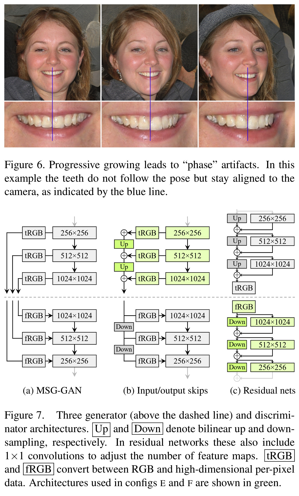

对此，论文测试了几种不同的改进方案 fig 7 用于替代Progressive growing。

上下分别表示 generator 和 discriminator。第一列参考了MSGGAN，它将generator中对应分辨率的图像输入到discriminator中对应分辨率的位置；第二列是skip-connection结构，它每次上采样的数据不仅feature map，还将该分辨率下的feature map转成RGB图做上采样，并逐级叠加；第三列是residual结构，它每次分别将feature map上采样和卷积，然后再叠加，每个block只输出一个feature map，转RGB只发生在最后一步。

最终的实验结果表明，skip-connetion 以及residual 结构会使得PPL下降很多。但作者说，residual可能对discriminator有更大的用处，因为discrimator本质上是分类器，而很多过去的实验都证明residual结构对分类器确实有帮助。然而，residual结构对generator却有负面影响。[4]

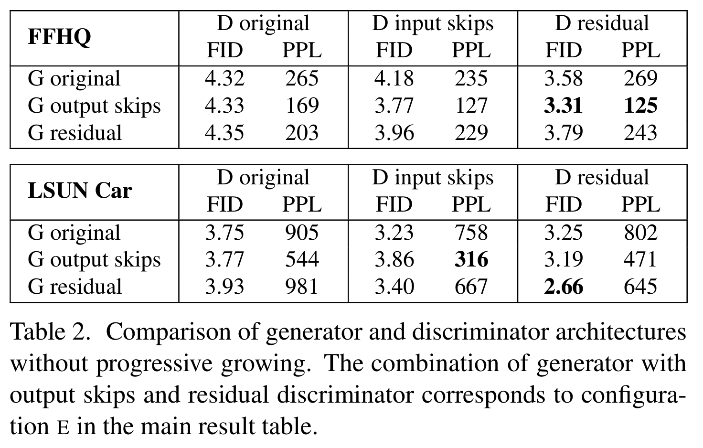

## 目标

动漫人脸生成

## 性能指标

1. Fréchet Inception Distance (FID) 用于衡量真实图像与生成图像之间特征向量的距离。

The Fréchet distance between two multivariate Gaussians $X_1 \sim \mathcal N(\mu_1, C_1)$ and $X_2 \sim \mathcal N(\mu_2, C_2)$ is

$$
d^2 = \|\mu_1 - \mu_2\|^2 + \text{Tr}(C_1 + C_2 - 2*\sqrt{C_1*C_2}).
$$

2. Anime Face Detection (AFD) Rate 用于衡量动漫人脸检测性能

检测提交的文件中有多少动漫人脸。

## Practice

做简单的水平翻转、旋转、色调调整的数据增强，把 timesteps 提高到 500，train_num_step 提高到 30k，即可通过 medium。

参照 hint，调整 channel 和 dim_mults，调大到 64 个 channel，维度改到 (1,2,4,8,16)。Varience Scheduler 参考 [denoising-diffusion-pytorch](https://github.com/lucidrains/denoising-diffusion-pytorch/blob/main/denoising_diffusion_pytorch/denoising_diffusion_pytorch.py#L445) 中的 cosine_beta_schedule()。

此时应该就能通过 Strong。

 |  simple    |   medium   | strong |
| ---- | ---- | ---- | 
|  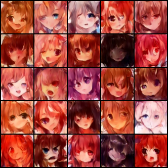 | 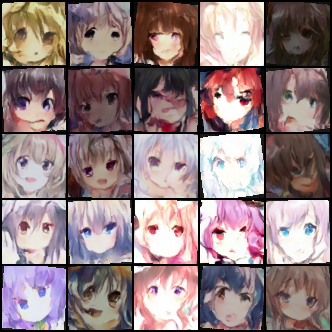 | 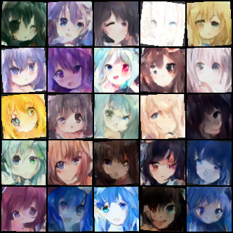 |

## Reference

[1] Karras T, Laine S, Aila T. A style-based generator architecture for generative adversarial networks[C]//Proceedings of the IEEE/CVF conference on computer vision and pattern recognition. 2019: 4401-4410.

[2] Hung-yi Lee, 【機器學習2021】生成式對抗網路 (Generative Adversarial Network, GAN) https://www.youtube.com/watch?v=4OWp0wDu6Xw

[3] Rani Horev, Explained: A Style-Based Generator Architecture for GANs - Generating and Tuning Realistic Artificial Faces https://medium.com/data-science/explained-a-style-based-generator-architecture-for-gans-generating-and-tuning-realistic-6cb2be0f431

[4] Silhouettem, 图像生成典中典：StyleGAN & StyleGAN2 论文&代码精读 https://zhuanlan.zhihu.com/p/435566899

[5] 奇迹小缘, StyleGAN 1.0 https://blog.csdn.net/qq_41061477/article/details/129041421

[6] Karras, T., Laine, S., Aittala, M., Hellsten, J., Lehtinen, J., & Aila, T. (2020). Analyzing and improving the image quality of stylegan. In Proceedings of the IEEE/CVF conference on computer vision and pattern recognition (pp. 8110-8119).

[7] bioinf-jku, TTUR Two time-scale update rule for training GANs https://github.com/bioinf-jku/TTUR