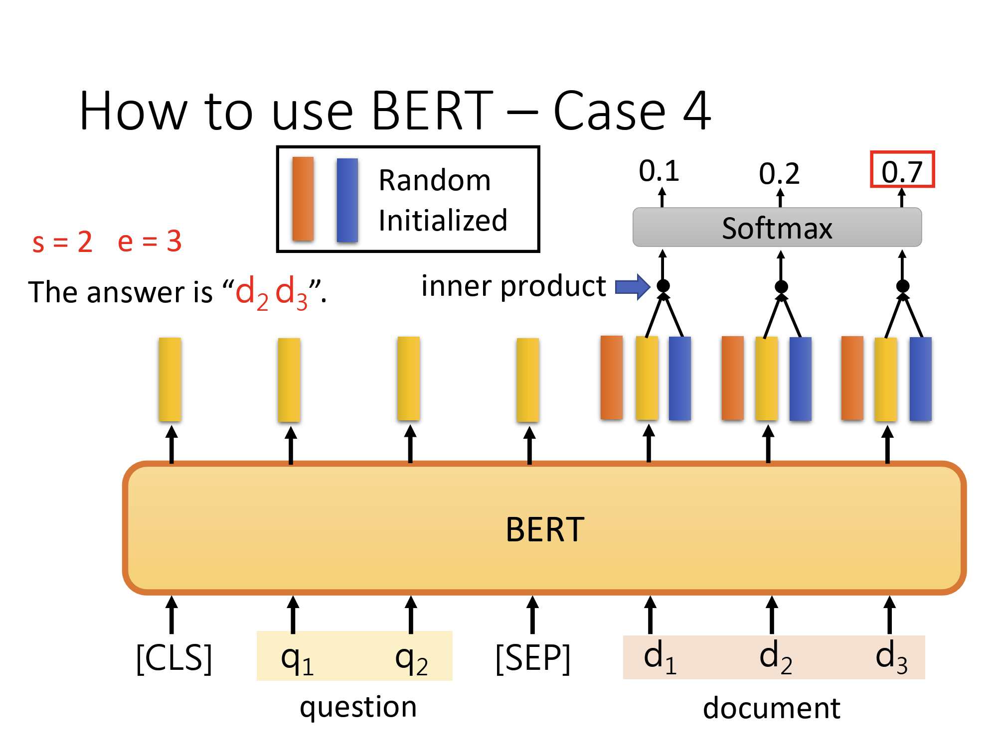

# HW7 BERT
> 2025.7.5 - 2025.7.7

## TODO

- [x] BERT

## Report

1. (2%) There are some difference between fine-tuning and prompting.  Beside fine-tuning, in-context learning enable pre-trained model to give correct prediction on many downstream tasks with a few examples but without gradient descent. Please describe: 

- A. How encoder-only model (Bert-series) determines the answer in a extractive question answering task? 
- B. How decoder-only model (GPT-series) determines the answer in a extractive question answering task?


A. Encoder-only 模型（BERT 系列）如何给出抽取式问答答案



1.	输入拼接与编码

格式：将问题（Question）与篇章（Passage）拼接为单个序列：
```
[CLS] 问题 tokens… [SEP] 篇章 tokens… [SEP]
```
编码：通过多层双向 Transformer（Self-Attention 无因果遮蔽），为序列中每个位置 i 计算上下文敏感的隐藏向量 $h_i\in \mathbb R^d$。

2.	起始/结束位置分类头

在最顶层隐藏向量上各自加一个线性层，得到“起始位置”与“结束位置”两个 Logits 分布：

$$
\begin{aligned}
s_i &= W_s^\top h_i + b_s\\
e_i &= W_e^\top h_i + b_e
\end{aligned}
$$

其中 $W_s, W_e\in\mathbb{R}^{d}，b_s,b_e\in\mathbb{R}$。

对所有篇章 token（通常跳过问题和特殊标记）分别做 Softmax，得到
$$
P_{\rm start}(i) = \frac{\exp(s_i)}{\sum_j \exp(s_j)},\quad
P_{\rm end}(i) = \frac{\exp(e_i)}{\sum_j \exp(e_j)}
$$

3.	答案跨度（Span）推理

在推理时，枚举所有合法的 $(i,j)$ 对，并选取使得
$$
P_{\rm start}(i)+ P_{\rm end}(j)
$$
最大的那一对 $(i,j)$。

最终答案即篇章中从第 $i$ 到 $j$ 的连续 token 序列。


B. Decoder-only 模型（GPT 系列）如何给出抽取式问答答案

1.	Prompt 设计与输入格式

通常将若干示例（few-shot）与当前问答一起拼成一个长序列：
```
示例 1: Context: … Question: … Answer: …  
示例 2: Context: … Question: … Answer: …  
…  
当前：Context: [篇章文本] Question: [问题文本] Answer:
```

该序列作为自回归语言模型的前缀（prefix）。

2.	自回归生成

GPT 在每一步 $t$（从 “Answer:” 之后的第一个 token）计算隐藏向量
$$
h_t = \mathrm{DecoderLayer}_L\bigl(\dots \mathrm{DecoderLayer}1(x{<t})\bigr)
$$
其中所有层均为带因果遮蔽（causal mask）的自注意力，只能访问当前位置之前的所有 token。

对应词表，计算下一 token 的概率分布：
$$
P(w_t\!\mid\!x_{<t}) = \mathrm{softmax}\bigl(W_o\,h_t + b_o\bigr).
$$
3.	答案生成与截断

从 “Answer:” 位置开始，按照上式依次贪心或束搜索地生成一串 token，直到遇到终止符。

由于示例中通常直接输出原文中的那段内容，模型学会“复述”篇章中对应的 span，实现“从篇章中抽取答案”的效果。

## Practice

运行 Simple Code，简单换了个 seed，Public Score 0.51532，Private Score 0.50113，通过 Simple Baseline。

根据 hint，应用 linear learning rate decay，此时注意 gradient accumulation 和 step 的关系。

```python
from transformers import get_linear_schedule_with_warmup
total_steps = len(train_loader) * num_epoch // gradient_accumulation_steps
warmup_steps = int(total_steps * 0.1)  # 10% of total steps for warmup
scheduler = get_linear_schedule_with_warmup(
	optimizer,
	num_warmup_steps=warmup_steps,
	num_training_steps=total_steps
)
...
for ...
	output = model(input_ids=data[0], token_type_ids=data[1], attention_mask=data[2], start_positions=data[3], end_positions=data[4])
	step += 1

	loss = output.loss / gradient_accumulation_steps
	accelerator.backward(loss)

	train_loss += output.loss.item()
	start_idx = torch.argmax(output.start_logits, dim=1)
	end_idx   = torch.argmax(output.end_logits,   dim=1)
	batch_acc = ((start_idx == data[3]) & (end_idx == data[4])).float().mean().item()
	train_acc  += batch_acc

	if step % gradient_accumulation_steps == 0 or step == len(train_loader): # Gradient Accumulation，等到了 batch 后再更新模型
		optimizer.step()
		scheduler.step()
		optimizer.zero_grad()
```

修改 doc_stride 的值，避免分割的时候恰好分割到 QA 对，暂时先修改到 max paragraph len 的一半。

此外，再顺手把 start_index > end_index 的 bug 修了，在 evaluation 时直接特判大于的时候不采纳。

为了防止 train 阶段模型“偷懒”直接学到答案在中央，添加一个 random_offset 做随机偏移。

```python
mid = (answer_start_token + answer_end_token) // 2
random_offset = np.random.randint(-self.max_paragraph_len // 4, self.max_paragraph_len // 4) # 随机偏移
paragraph_start = max(0, min(mid + random_offset - self.max_paragraph_len // 2, len(tokenized_paragraph) - self.max_paragraph_len))
paragraph_end = paragraph_start + self.max_paragraph_len
```

此时 Public Score 0.76333，Private Score 0.76220，直接通过 Strong Baseline。

略微调小 learning rate，使之能够学到更多，Public Score 0.76844, Private Score 0.76674。

时过境迁，现在已经是 2025 年，相比 2023 年在 huggingface 上已经涌现了大批量的模型，且模型的体量也越来越大。

考虑到 Sample Code 给出的是 Google-bert/bert-base-chinese 只有 103M 参数，因此考虑替换成类似体量的 model。

换用一个更大的模型 albert_chinese_xxlarge 222M，Public Score 0.74574，Private Score 0.76220，提升并不大。


| Model Name                                                   | Parameter | Public Score | Private Score |
| ------------------------------------------------------------ | --------- | ------------ | ------------- |
| [google-bert/bert-base-chinese](https://huggingface.co/google-bert/bert-base-chinese) | 103M      | 0.74290      | 0.73212       |
| [voidful/albert_chinese_xxlarge](https://huggingface.co/voidful/albert_chinese_xxlarge) | 222M      | 0.74574      | 0.76220       |
| [google-bert/bert-base-multilingual-cased](https://huggingface.co/google-bert/bert-base-multilingual-cased) | 179M      | 0.72814      | 0.71509       |
| [luhua/chinese_pretrain_mrc_macbert_large](https://huggingface.co/luhua/chinese_pretrain_mrc_macbert_large) |  324M      | **0.81157**  | **0.80987**   |

再次打开 result.csv，发现出现了一部分 [CLS]，在 evaluation 部分再加一层 mask，留下段落中的部分。

对 doc_stride 进行调整，对比如下：

| doc_stride | Public Score | Private Score |
| ---------- | ------------ | ------------- |
| 50         | 0.81157      | 0.80987       |
| 30         | 0.82463      | 0.83371       |
| 15         | 0.82690      | 0.83427       |


合并上 dev 一起 train 最后一发：Public Score 0.82690, Private Score 0.83768

## Reference

[1] Hung-yi Lee, 【生成式AI】Finetuning vs. Prompting：對於大型語言模型的不同期待所衍生的兩類使用方式 https://www.youtube.com/watch?v=F58vJcGgjt0

[2] Hung-yi Lee, 【機器學習2021】自督導式學習 (Self-supervised Learning) https://www.youtube.com/watch?v=e422eloJ0W4
